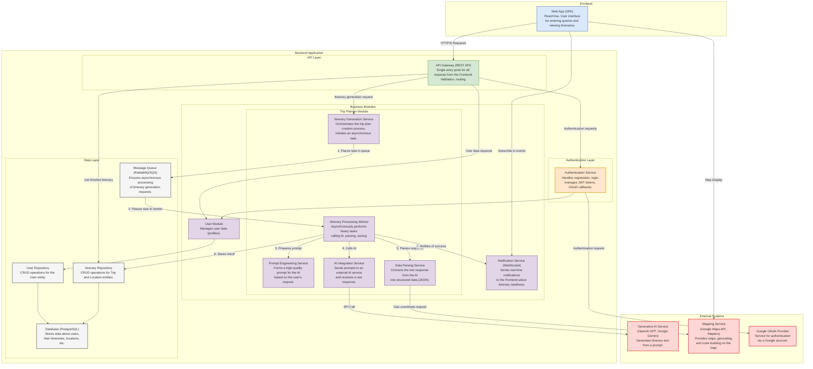

```mermaid
graph TD
    subgraph Frontend
        direction LR
        WebApp["Web App (SPA)<br/>React/Vue. User interface<br/>for entering queries and viewing itineraries."]:::frontend
    end

    subgraph Backend Application
        direction TB
        
        subgraph API Layer
            APIGateway["API Gateway (REST API)<br/>Single entry point for all requests from the Frontend.<br/>Validation, routing."]:::api
        end

        subgraph Authentication Layer
            AuthService["Authentication Service<br/>Handles registration, login,<br/>manages JWT tokens, OAuth callbacks."]:::auth
        end

        subgraph Business Modules
            direction LR
            UserModule["User Module<br/>Manages user data (profiles)."]:::business
            
            subgraph Trip Planner Module
                TripGenerationService["Itinerary Generation Service<br/>Orchestrates the trip plan creation process.<br/>Initiates an asynchronous task."]:::business
                TripProcessingWorker["Itinerary Processing Worker<br/>Asynchronously performs heavy tasks:<br/>calling AI, parsing, saving."]:::business
                PromptEngineeringService["Prompt Engineering Service<br/>Forms a high-quality prompt for the AI<br/>based on the user's request."]:::business
                AIIntegrationService["AI Integration Service<br/>Sends prompts to an external AI service<br/>and receives a raw response."]:::business
                DataParsingService["Data Parsing Service<br/>Converts the text response from the AI<br/>into structured data (JSON)."]:::business
            end

            NotificationService["Notification Service (WebSocket)<br/>Sends real-time notifications<br/>to the Frontend about itinerary readiness."]:::business
        end

        subgraph Data Layer
            direction LR
            UserRepository["User Repository<br/>CRUD operations for the User entity."]:::data
            TripRepository["Itinerary Repository<br/>CRUD operations for Trip and Location entities."]:::data
            Database["Database (PostgreSQL)<br/>Stores data about users,<br/>their itineraries, locations, etc."]:::data
            MessageQueue["Message Queue (RabbitMQ/SQS)<br/>Ensures asynchronous processing<br/>of itinerary generation requests."]:::data
        end
    end

    subgraph External Systems
        direction LR
        GenerativeAI["Generative AI Service<br/>(OpenAI GPT, Google Gemini)<br/>Generates itinerary text from a prompt."]:::external
        MappingService["Mapping Service<br/>(Google Maps API, Mapbox)<br/>Provides maps, geocoding,<br/>and route building on the map."]:::external
        GoogleOAuth["Google OAuth Provider<br/>Service for authentication<br/>via a Google account."]:::external
    end

    %% Styles Definition
    classDef frontend fill:#DAE8FC,stroke:#6C8EBF,stroke-width:2px;
    classDef api fill:#D5E8D4,stroke:#82B366,stroke-width:2px;
    classDef auth fill:#FFE6CC,stroke:#D79B00,stroke-width:2px;
    classDef business fill:#E1D5E7,stroke:#9673A6,stroke-width:2px;
    classDef data fill:#F5F5F5,stroke:#666666,stroke-width:2px;
    classDef external fill:#FFD6D6,stroke:#D93030,stroke-width:2px;

    %% Applying Styles
    class WebApp frontend;
    class APIGateway api;
    class AuthService auth;
    class UserModule,TripGenerationService,TripProcessingWorker,PromptEngineeringService,AIIntegrationService,DataParsingService,NotificationService business;
    class UserRepository,TripRepository,Database,MessageQueue data;
    class GenerativeAI,MappingService,GoogleOAuth external;

    %% Connections
    WebApp -- "HTTP/S Requests" --> APIGateway;
    WebApp -- "Map Display" --> MappingService;
    WebApp -- "Subscribe to events" --> NotificationService;
    
    APIGateway -- "Authentication requests" --> AuthService;
    APIGateway -- "User data requests" --> UserModule;
    APIGateway -- "Itinerary generation request" --> TripGenerationService;
    APIGateway -- "Get finished itinerary" --> TripRepository;
    
    AuthService --> UserModule;
    AuthService -- "Authentication request" --> GoogleOAuth;

    UserModule --> UserRepository;
    UserRepository --> Database;
    
    TripGenerationService -- "1. Places task in queue" --> MessageQueue;
    
    MessageQueue -- "2. Passes task to worker" --> TripProcessingWorker;
    
    TripProcessingWorker -- "3. Prepares prompt" --> PromptEngineeringService;
    TripProcessingWorker -- "4. Calls AI" --> AIIntegrationService;
    AIIntegrationService -- "API Call" --> GenerativeAI;
    TripProcessingWorker -- "5. Parses response" --> DataParsingService;
    DataParsingService -- "Geo-coordinate request" --> MappingService;
    TripProcessingWorker -- "6. Saves result" --> TripRepository;
    TripRepository --> Database;
    
    TripProcessingWorker -- "7. Notifies of success" --> NotificationService;
```
