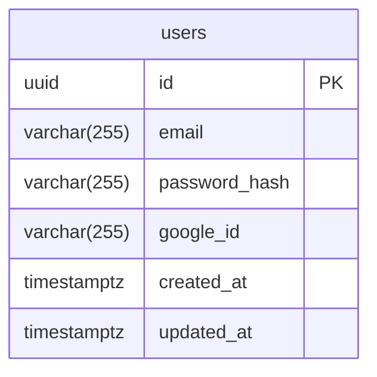

# Entity: User

## 1) Entity Specifications
### Entity: `users`
**Description:** Represents a user of the "Localize" system.

**Attributes**
| Field | Data Type | Description | Constraints/Notes | Required |
|---|---|---|---|---|
| id | uuid | PK | PRIMARY KEY, default gen_random_uuid() | yes |
| email | varchar(255) | User's email | UNIQUE, NOT NULL | yes |
| password_hash | varchar(255) | Password hash | NULLable (for OAuth) | no |
| google_id | varchar(255) | User's ID in Google | UNIQUE, NULLable | no |
| created_at | timestamptz | Creation date | NOT NULL, default now() | yes |
| updated_at | timestamptz | Update date | NOT NULL, default now() | yes |

**Relationships**
- The `users` entity can have a 1:N relationship with the `trips` entity (itineraries).

**Indexes and Performance**
- `users_email_idx` (B-Tree) on the `email` field for fast lookups on login.
- `users_google_id_idx` (B-Tree) on the `google_id` field for fast lookups on login with Google.

## 7) ERD (Mermaid)

## 8) Open Questions
- **[OPEN QUESTION]** Do we need to store additional data from the Google profile (name, avatar)? This is not required for the MVP.
