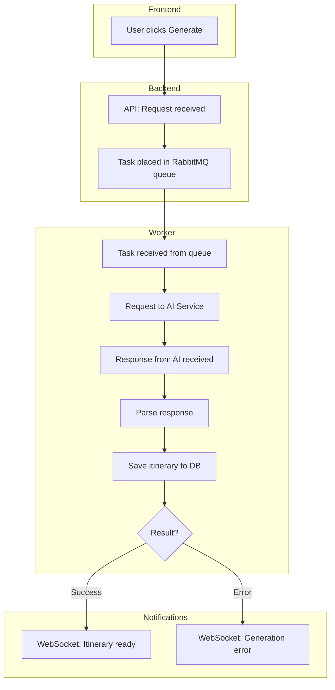

```mermaid
graph TD
    subgraph Frontend
        A[User clicks Generate]
    end

    subgraph Backend
        B[API: Request received]
        C[Task placed in RabbitMQ queue]
    end

    subgraph Worker
        D[Task received from queue]
        E[Request to AI Service]
        F[Response from AI received]
        G[Parse response]
        H[Save itinerary to DB]
        I{Result?}
    end
    
    subgraph Notifications
        J[WebSocket: Itinerary ready]
        K[WebSocket: Generation error]
    end

    A --> B
    B --> C
    C --> D
    D --> E
    E --> F
    F --> G
    G --> H
    H --> I
    I -- Success --> J
    I -- Error --> K
```
