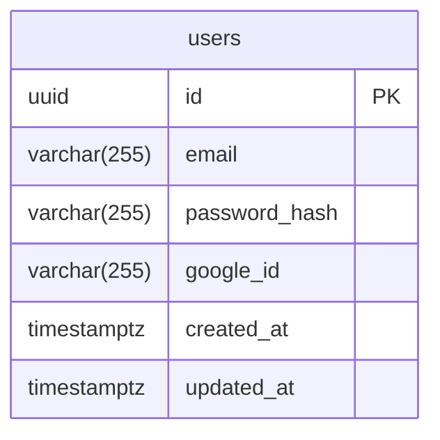

# Entity: User

## 1) Спецификации сущности
### Сущность: `users`
**Описание:** Представляет пользователя системы "Localize".

**Атрибуты**
| Поле | Тип данных | Описание | Ограничения/Примечания | Обязательное |
|---|---|---|---|---|
| id | uuid | PK | PRIMARY KEY, default gen_random_uuid() | да |
| email | varchar(255) | Email пользователя | UNIQUE, NOT NULL | да |
| password_hash | varchar(255) | Хеш пароля | NULLable (для OAuth) | нет |
| google_id | varchar(255) | ID пользователя в Google | UNIQUE, NULLable | нет |
| created_at | timestamptz | Дата создания | NOT NULL, default now() | да |
| updated_at | timestamptz | Дата обновления | NOT NULL, default now() | да |

**Связи**
- У сущности `users` могут быть связи 1:N с сущностями `trips` (маршруты).

**Индексы и производительность**
- `users_email_idx` (B-Tree) на поле `email` для быстрого поиска при входе.
- `users_google_id_idx` (B-Tree) на поле `google_id` для быстрого поиска при входе через Google.

## 7) ERD (Mermaid)

## 8) Открытые вопросы
- **[OPEN QUESTION]** Нужно ли хранить дополнительные данные из профиля Google (имя, аватар)? Для MVP это не требуется.
