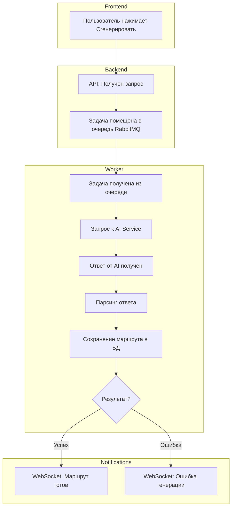

```mermaid
graph TD
    subgraph Frontend
        A[Пользователь нажимает Сгенерировать]
    end

    subgraph Backend
        B[API: Получен запрос]
        C[Задача помещена в очередь RabbitMQ]
    end

    subgraph Worker
        D[Задача получена из очереди]
        E[Запрос к AI Service]
        F[Ответ от AI получен]
        G[Парсинг ответа]
        H[Сохранение маршрута в БД]
        I{Результат?}
    end
    
    subgraph Notifications
        J[WebSocket: Маршрут готов]
        K[WebSocket: Ошибка генерации]
    end

    A --> B
    B --> C
    C --> D
    D --> E
    E --> F
    F --> G
    G --> H
    H --> I
    I -- Успех --> J
    I -- Ошибка --> K
```